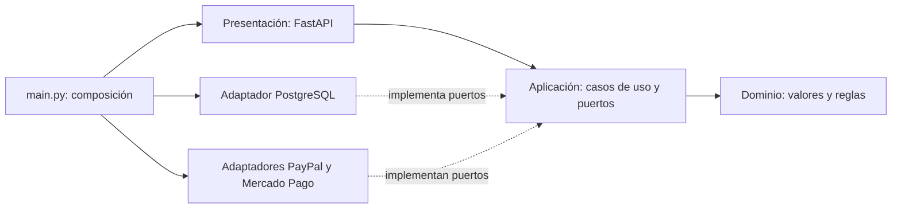

# Arquitectura hexagonal de Julia

El backend concentra las reglas comerciales en un núcleo independiente de FastAPI,
PostgreSQL y las pasarelas. Los adaptadores implementan los puertos que necesitan
los casos de uso. `backend/main.py` conecta las implementaciones concretas.

En Docker, el puerto `Payments` se implementa con `RemotePayments`, que llama a
un servicio independiente definido en `backend/payments_main.py`. Este proceso
compone las pasarelas y no accede a PostgreSQL. Véase
[MICROSERVICIOS.md](MICROSERVICIOS.md) para el despliegue y el contrato versionado.

## Dirección de dependencias



Las flechas representan dependencias de código. En ejecución, los casos de uso
invocan los repositorios y pasarelas recibidos en sus constructores. El núcleo
nunca importa sus implementaciones. No se necesita un contenedor de inyección:
los constructores y las dependencias de FastAPI bastan para este proyecto.

## Backend

| Ubicación | Responsabilidad |
| --- | --- |
| `domain/orders.py` | Valores inmutables, cantidades, redondeo de líneas, conversión y límites de importes. |
| `domain/errors.py` | Errores semánticos sin códigos HTTP. |
| `application/ports.py` | Contratos `Protocol` para catálogo, ventas, pedidos y pagos. |
| `application/catalog.py` | Consultar catálogo público, panel y registrar ventas. |
| `application/checkout.py` | Crear, consultar, pagar, confirmar, simular y reconciliar pedidos. |
| `infrastructure/postgres.py` | SQL y bloqueos de los repositorios PostgreSQL. |
| `infrastructure/queries.py` | Consultas de catálogo y estadísticas. |
| `infrastructure/payments.py` | HTTP externo, credenciales, configuración y adaptadores de pasarelas. |
| `infrastructure/remote_payments.py` | Puerto Payments implementado sobre HTTP interno; validación de respuestas y timeouts. |
| `contracts/payments_v1.py` | DTO Pydantic del límite entre comercio y pagos; no forma parte del núcleo. |
| `presentation/schemas.py` | Contrato JSON de entrada y conversión a comandos del núcleo. |
| `presentation/http.py` | Rutas, autenticación Bearer y traducción de errores a HTTP. |
| `presentation/common.py` | Autenticación y traducción de errores compartidas por ambos servicios. |
| `main.py` | Arranque, pool, transacción por solicitud e inyección de dependencias. |
| `payments_main.py` | Composición del servicio independiente de pagos y API interna `/v1`. |

Los pedidos y productos leídos por repositorios usan diccionarios de valores;
no llevan conexiones, cursores ni modelos ORM. Los comandos de creación usan
dataclasses y `Decimal`. Se conservan las proyecciones JSON existentes para que
el frontend y los pedidos guardados sigan funcionando.

## SOLID aplicado

| Principio | Aplicación concreta |
| --- | --- |
| Responsabilidad única | Las rutas adaptan HTTP; los casos de uso coordinan negocio; los repositorios ejecutan SQL. |
| Abierto/cerrado | Un adaptador alternativo puede implementar un puerto e inyectarse en la composición. Sustituir una pasarela para un método existente no cambia `Checkout`. |
| Sustitución de Liskov | Los dobles en memoria respetan las operaciones y resultados del contrato. PostgreSQL se comprueba con pruebas de integración; el doble no pretende reproducir sus bloqueos. |
| Segregación de interfaces | Catálogo, ventas y pedidos tienen puertos separados. Un consumidor del catálogo no necesita implementar operaciones de pago. |
| Inversión de dependencias | El núcleo declara los puertos. PostgreSQL, HTTP y la composición dependen de esos contratos. |

Agregar un método comercial nuevo puede requerir ampliar el contrato JSON,
su configuración y las reglas de moneda. Poder intercambiar adaptadores no
elimina esos cambios de negocio explícitos.

## Transacciones y compatibilidad

Una solicitud usa una sola conexión y transacción PostgreSQL. Todos los métodos
del repositorio de pedidos comparten esa conexión; no hacen commits individuales.
El contexto del pool confirma al terminar y revierte ante una excepción.
Esta transacción solo abarca PostgreSQL. Las operaciones externas de pago quedan
fuera de ella; un timeout mantiene el pedido pendiente para verificación posterior.

- `find_request` mantiene el bloqueo transaccional por propietario y clave de
  idempotencia. El hash continúa calculándose sobre el mismo JSON validado que
  antes del refactor, para aceptar reintentos de pedidos existentes.
- `active_products` mantiene `FOR SHARE` para conservar precios durante la creación.
- `get_owned` limita la lectura al propietario y mantiene `FOR UPDATE` durante
  pago, confirmación o simulación.
- `settle` guarda estado y ventas históricas en la misma transacción. La restricción
  única y `ON CONFLICT` siguen evitando ventas duplicadas.
- Reconciliación mantiene `FOR UPDATE SKIP LOCKED` y lotes de hasta 50 pedidos.
- `demo` y `sandbox` no contabilizan ventas reales.

Se conservan las rutas, autenticación, esquema y formatos de respuesta existentes.
No hace falta migrar datos. Los errores del negocio se traducen en un único punto
a 403, 404, 409, 422, 502 o 503; Pydantic conserva la validación del JSON de entrada.

## Servidor web de Next.js

`lib/backend.js` es el punto de composición que siguen importando las páginas y
Server Actions. Selecciona el adaptador HTTP cuando existe `BACKEND_URL`; en caso
contrario conserva el modo PostgreSQL directo.

- `lib/application/store.js` define los contratos mediante JSDoc, exige autorización
  para operaciones privadas, valida ventas y limita los campos del catálogo público.
- `lib/infrastructure/httpStore.js` implementa las llamadas a FastAPI con un cliente
  `fetch` inyectable.
- `lib/infrastructure/postgresStore.js` implementa el modo directo existente y la
  inicialización/pool que también utiliza Auth.js.
- `lib/presentation/panelAccess.js` adapta cookies y redirecciones de Next.js al
  puerto de autorización.
- `lib/db.js` conserva las exportaciones de persistencia que usa Auth.js.

El checkout sigue entrando por el proxy de Next.js y ejecuta sus casos de uso en
FastAPI. El proxy conserva cookies de propietario, comprobación de origen y su
lista de rutas permitidas. La interfaz React no necesita capas de dominio duplicadas.

El modo PostgreSQL directo y las tablas de Auth.js se mantienen por compatibilidad.
No se unificaron los dos arranques de esquema ni se eliminó el fallback de Vercel.

## Pruebas

Núcleo Python, solo biblioteca estándar y sin servicios externos, desde `backend/`:

```bash
python3 -m unittest discover -s tests -p test_core.py -v
```

Servidor web, desde la raíz:

```bash
npm test
npm run lint
npm run build
```

Suite completa de Python con PostgreSQL, desde la raíz:

```bash
docker compose -f compose.yaml -f compose.test.yaml --profile test run --build --rm backend-tests
```

La suite del núcleo prueba redondeo, límites, propiedad de pedidos, reintentos,
conversión y estados de pago mediante dobles. Incluye una prueba de dependencias
que rechaza importaciones de frameworks o adaptadores dentro del núcleo.
Las pruebas de API conservan rollback para no guardar pedidos ni ventas de prueba.
`test_payments_service.py` valida el contrato entre servicios y los errores de red;
`test_microservices.py` utiliza PostgreSQL y el contenedor demo `payments-test`.
Las respuestas de pasarelas se simulan; estas pruebas no certifican cuentas de
comercio ni realizan cobros.
