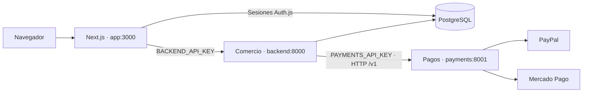

# Servicios de Julia

Julia tiene dos servicios de negocio desplegables de forma independiente:
**comercio** y **pagos**. Next.js sirve la interfaz y actúa como entrada para el
navegador. El repositorio sigue siendo único, con dos imágenes Python distintas.



## Límites y propiedad de datos

| Servicio | Responsabilidades | Persistencia |
| --- | --- | --- |
| Comercio | Catálogo, precios, pedidos, propietarios, idempotencia, ventas, estadísticas y simulaciones demo. | Tablas comerciales de PostgreSQL. |
| Pagos | Configuración de métodos, inicio de checkout alojado y verificación/captura con las pasarelas. | Sin base de datos. Recibe un snapshot limitado del pedido y devuelve una referencia, URL o confirmación. |
| Next.js | Interfaz, carrito, sesión del cliente, panel y proxy del checkout. | Auth.js conserva sus tablas actuales; el carrito se guarda en el navegador. |

Pedidos y ventas permanecen en comercio porque su confirmación es una transacción
local. Pagos no consulta ni modifica esas tablas. Esto permite separar credenciales,
reconstruir o reiniciar pagos sin reiniciar comercio, manteniendo los datos actuales.
No se añadieron una base duplicada, un broker ni transacciones distribuidas.

## Contrato interno v1

Todos los endpoints salvo `/health` requieren `Authorization: Bearer PAYMENTS_API_KEY`.
Esta clave es distinta de `BACKEND_API_KEY`; no se entrega al frontend.

| Método y ruta | Entrada / salida |
| --- | --- |
| `GET /health` | Salud del proceso: `status` y `service`. No consulta las pasarelas. |
| `GET /v1/config` | Modo, tipo de cambio y disponibilidad de los tres métodos. Sin secretos. |
| `POST /v1/payments/start` | Snapshot del pedido → `reference` y `url` HTTPS. |
| `POST /v1/payments/verify` | `{order: snapshot, capture: boolean}` → `payment_id`, o `null` si no hay confirmación. |

El snapshot contiene UUID, método, modo, total en céntimos, importe/moneda de cobro,
correo y referencia de pasarela. No incluye propietario, nombre, teléfono, costos
ni credenciales. `contracts/payments_v1.py` valida tanto peticiones como respuestas:
tipos estrictos para importes, moneda compatible y campos adicionales rechazados.

`RemotePayments` implementa el mismo puerto hexagonal que `HostedPayments`; los
casos de uso no importan clientes HTTP. El proceso de comercio elige el adaptador
remoto cuando existe `PAYMENTS_SERVICE_URL`. Si esa variable se omite, conserva
el adaptador integrado para desarrollo. Un error de red nunca activa un fallback
automático al adaptador integrado.

## Ejecución

Configura `.env` según `.env.example`. Para actualizar una instalación anterior,
añade `PAYMENTS_API_KEY` con un secreto nuevo (`openssl rand -hex 32`). El volumen
PostgreSQL y los pedidos existentes se conservan; no hay migración de esquema.

```bash
docker compose up --build -d
docker compose ps
```

La web queda en `http://localhost:3000` y la API de comercio en
`http://localhost:8000/docs`. Pagos escucha en `payments:8001` dentro de Docker,
sin publicar ese puerto al host. Su imagen no instala Psycopg, no contiene el
repositorio SQL y no recibe `DATABASE_URL`.

Actualizar un servicio:

```bash
docker compose up --build -d payments
docker compose up --build -d backend
docker compose logs -f payments
```

Para escalar pagos en desarrollo:

```bash
docker compose up -d --scale payments=2
```

El servicio no guarda estado en memoria entre solicitudes. Docker resuelve el
nombre interno; un despliegue multi-host necesita su propio balanceador, red y
gestión de secretos. Para ese despliegue usa HTTPS entre servicios y configura
`PAYMENTS_SERVICE_URL` con la dirección interna correspondiente.

Las imágenes comparten una versión del contrato dentro del monorepo. Para cambios
incompatibles publica un nuevo contrato y endpoint (`/v2`) y migra el consumidor
antes de retirar `/v1`.

## Fallos y consistencia

- Las llamadas internas usan timeout de conexión de 3 segundos, lectura de 5 para
  configuración y de 35 para inicio/verificación. Son límites por operación de
  red, no una garantía de tiempo total de todo el checkout.
- No hay reintentos automáticos de mutaciones. Ante timeout, se devuelve 503 y el
  comprador puede reintentar el mismo pedido. Respuestas inválidas producen 502.
- Comercio solo guarda un pago confirmado después de validar la respuesta interna.
  Los adaptadores de pasarelas siguen comprobando referencia, importe, moneda y
  entorno. Las restricciones PostgreSQL siguen evitando ventas duplicadas.
- Si pagos cae después del arranque, catálogo, panel y lectura de pedidos siguen
  disponibles. Crear pedidos, obtener configuración y operaciones que necesitan
  pagos devuelven error controlado. Los healthchecks de comercio comprueban su DB;
  no fallan por una interrupción del servicio de pagos.
- Una captura externa no se revierte con el rollback SQL. Si se pierde la respuesta,
  la siguiente verificación o `/checkout/reconcile` consulta la pasarela otra vez.
  PayPal conserva sus claves de idempotencia basadas en el UUID del pedido.
- Un fallo después de crear una preferencia de Mercado Pago pero antes de guardar
  su referencia puede dejar una preferencia huérfana. No se implementa una garantía
  de ejecución exactamente una vez entre servicios y pasarelas.

La reconciliación continúa siendo una operación explícita del servicio de comercio.
Esta entrega no añade webhooks, un programador de reconciliación ni valida cuentas
de comercio reales. El modo demo no llama a proveedores externos.

## Pruebas

```bash
docker compose -f compose.yaml -f compose.test.yaml --profile test run --build --rm backend-tests
npm test
npm run lint
```

La suite incluye dominio, API y PostgreSQL con rollback; pruebas del contrato y
fallos de red; y comunicación HTTP real desde comercio hacia `payments-test`.
Esta instancia de pruebas tiene modo demo y no recibe credenciales de pasarelas.
No modifica el modo del servicio `payments` habitual. Los pagos sandbox/live de
las pruebas usan respuestas simuladas, sin cobros ni llamadas externas.

Para detener la instancia temporal al terminar:

```bash
docker compose -f compose.yaml -f compose.test.yaml --profile test stop payments-test
```
